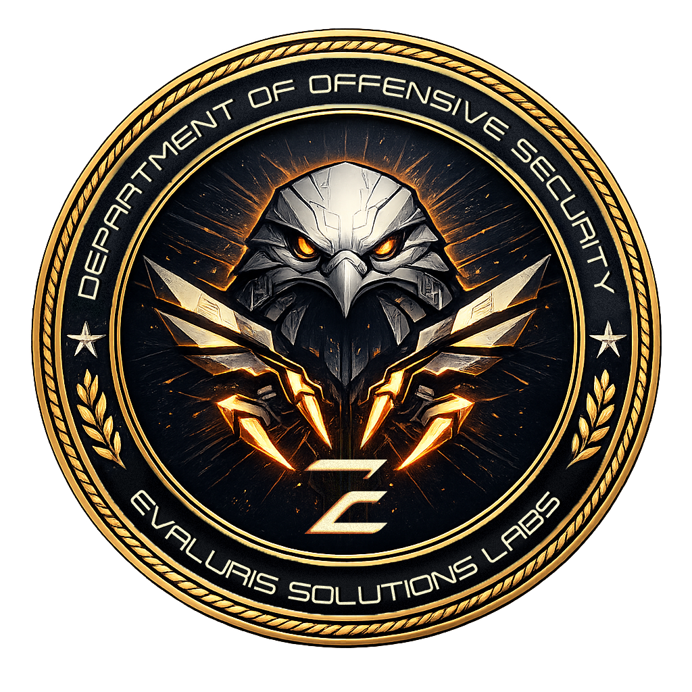

<div align="center">
  <table align="center" role="presentation" cellspacing="0" cellpadding="0">
    <tr>
      <td valign="middle"></td>
      <td width="20"></td>
      <td valign="middle"></td>
    </tr>
  </table>
  <br/>
  
</div>

<div align="center">

# Claude Active Directory

**ROE-first AI harness for Active Directory offensive security** — eight skill domains, thirteen slash commands, seven agents, validation gates, and evidence-ready reporting for authorized internal assessments and red teams.

### The power of structured AI assistance for Active Directory offensive security

**Claude Active Directory** turns **Claude Code** (and compatible editors) into an engagement-aware copilot so operators spend less time reinventing methodology and more time proving impact with defensible evidence.

*Part of the **Department of Offensive Security (DoOS)** — [Evaluris Solutions](https://evaluris.ae).*

<br>


### AI agent harness for professional Active Directory penetration testing

*Structured methodology, validation, and reporting for authorized internal assessments and red team engagements.*

<br>

[](LICENSE)
[](https://python.org)
[](https://claude.ai/claude-code)

**Evaluris Team** · **[Evaluris Solutions](https://evaluris.ae)** · DoOS

<br>

<p><strong>At a glance</strong></p>

<table align="center" role="presentation" cellspacing="0" cellpadding="10">
  <tr>
    <td align="center" valign="top"><strong>13</strong><br />slash commands</td>
    <td align="center" valign="middle" width="28">&nbsp;&nbsp;·&nbsp;&nbsp;</td>
    <td align="center" valign="top"><strong>7</strong><br />AI agents</td>
    <td align="center" valign="middle" width="28">·</td>
    <td align="center" valign="top"><strong>8</strong><br />skill domains</td>
  </tr>
</table>

<p><em>Kerberos · LDAP · AD CS · Delegation · BloodHound-style analysis</em></p>

<p><sub>Optional integrations — <strong>Burp MCP</strong> for HTTP surfaces (OWA, AD FS, certificate enrollment web)</sub></p>

</div>

---

## Skill domains (8) and MITRE ATT&CK alignment

Tactics are **illustrative** — many skills span multiple tactics. Map findings to [MITRE ATT&CK](https://attack.mitre.org/) in your report when the customer expects it (see `finding-validation` skill).

| Skill | Primary MITRE tactics (examples) | One-line purpose |
|-------|----------------------------------|------------------|
| [ad-pentest](skills/ad-pentest/SKILL.md) | Discovery, Credential Access, Privilege Escalation, Lateral Movement | Master workflow: ROE, phases, path hunting, deliverable standards |
| [ad-methodology](skills/ad-methodology/SKILL.md) | Discovery → Impact (orchestration) | Engagement pacing, stuck routing, skill reading order, session discipline |
| [ad-recon](skills/ad-recon/SKILL.md) | Discovery | DNS, trusts, LDAP/LDAPS, SMB, Kerberos signals, BloodHound collection choice |
| [ad-attack-classes](skills/ad-attack-classes/SKILL.md) | Credential Access, Privilege Escalation, Lateral Movement | Technique reference, coercion awareness, lateral matrix, trust/SQL notes |
| [ad-arsenal](skills/ad-arsenal/SKILL.md) | Discovery, Credential Access | Tool patterns, Event IDs, OPSEC / telemetry classes |
| [ad-cs-pki](skills/ad-cs-pki/SKILL.md) | Credential Access, Privilege Escalation | AD CS / PKI, ESC evidence bundles, DC certificate posture |
| [finding-validation](skills/finding-validation/SKILL.md) | — (quality gate) | False positives, severity rubric, ATT&CK mapping pattern |
| [engagement-reporting](skills/engagement-reporting/SKILL.md) | — (reporting) | Executive + technical structure, AD finding fields |

**Glossary:** [docs/ad-glossary.md](docs/ad-glossary.md) · **External links:** [docs/ad-resources.md](docs/ad-resources.md)

---

## Slash commands (13) — syntax, purpose, ROE gate

| Command | Invocation | Purpose | ROE gate |
|---------|------------|---------|----------|
| `/scope` | `/scope` or `/scope <domain>` | Confirm written authorization, allow lists, exclusions, destructive rules | **Canonical ROE check** — run first on every engagement |
| `/recon` | `/recon <domain>` | DNS, LDAP, SMB, Kerberos discovery, BH prep | Confirm `/scope` or equivalent ROE; no out-of-scope hosts |
| `/hunt` | `/hunt <domain>` | Credential and escalation phase within ROE | **Must** align with spray/relay/destruction rules from ROE |
| `/validate` | `/validate` | Validate a finding before client report | ROE + evidence replay |
| `/triage` | `/triage` | Quick validation pass | Same as validate (lighter) |
| `/report` | `/report` | Engagement-style technical report | Scope and limitations from ROE |
| `/chain` | `/chain` | Multi-hop attack path narrative | Only in-scope primitives |
| `/surface` | `/surface` | Prioritize paths / hosts from notes or graph | ROE for any follow-on testing |
| `/autopilot` | `/autopilot` | Phased ROE-safe checklist | No steps outside ROE |
| `/intel` | `/intel` | DC/patch intel | Target OS must be in scope |
| `/resume` | `/resume` | Resume engagement context | N/A (read-mostly) |
| `/remember` | `/remember` | Log to engagement memory | No classified customer data in repo |
| `/web3-audit` | `/web3-audit` | AD CS / PKI audit (legacy filename) | CA/web enrollment hosts in scope |

---

## Agents (7) — role, I/O, handoff

| Agent | Role | Inputs | Outputs | Handoff / stop |
|-------|------|--------|---------|-----------------|
| [recon-agent](agents/recon-agent.md) | Recon guidance | Domain, ROE, optional prior notes | `recon/<domain>/` layout, enum summary | **recon-ranker** or **validator** when paths known |
| [recon-ranker](agents/recon-ranker.md) | Prioritize attack paths | Graph or notes + ROE | Ranked path list | **chain-builder** or **validator** |
| [validator](agents/validator.md) | Finding QA | Single finding + evidence | PASS / KILL / DOWNGRADE / CHAIN | **report-writer** if PASS; else stop |
| [report-writer](agents/report-writer.md) | Report drafting | Validated findings set | Report sections | Customer delivery (human) |
| [chain-builder](agents/chain-builder.md) | Multi-hop chains | Confirmed primitives | Chain narrative | **validator** then **report-writer** |
| [ad-cs-auditor](agents/ad-cs-auditor.md) | PKI / ESC review | Certipy-style findings, CA names | ESC-oriented evidence list | **validator** / **report-writer** |
| [autopilot](agents/autopilot.md) | Phased checklist | ROE + time box | Checklist state | **Stop** for human if ROE unclear |

---

## Install (three commands or fewer)

**Claude Code** (default — copies to `~/.claude/skills` and `~/.claude/commands`):

```bash
git clone https://github.com/Evaluris-Solutions/claude-active-directory.git
cd claude-active-directory
chmod +x install.sh scripts/install.sh scripts/convert.sh && ./install.sh
```

**Cursor** (uses `~/.cursor/skills` and `~/.cursor/commands`; paths may vary by Cursor version — verify in Cursor docs if commands do not appear):

```bash
git clone https://github.com/Evaluris-Solutions/claude-active-directory.git
cd claude-active-directory
chmod +x install.sh scripts/install.sh scripts/convert.sh && ./install.sh cursor
```

**Gemini / other CLIs** — no single global path across releases; run `./install.sh gemini` for manual copy instructions, or use `./scripts/convert.sh --flat ./export` then import flat markdown per your CLI’s docs.

**Advanced:** `./install.sh all` installs to both Claude and Cursor home locations. **`./scripts/convert.sh --flat <dir>`** exports each `SKILL.md` as `<skill-name>.md` for tools that expect a flat tree.

---

## Authorized use

Use **only** on systems you own or are **explicitly authorized** to test in writing. Unauthorized access is illegal. Maintain a clear **rules of engagement** (domains, DCs, subnets, destructive vs read-only, spray approval). **Validate** findings before customer-facing reports. See [rules/hunting.md](rules/hunting.md). Vulnerabilities in **this repository’s code** — see [SECURITY.md](SECURITY.md).

---

## Documentation and contributing

| Resource | Description |
|----------|-------------|
| [CLAUDE.md](CLAUDE.md) | Plugin layout: skills, commands, tools, memory |
| [docs/ad-glossary.md](docs/ad-glossary.md) | AD / Kerberos terms |
| [docs/ad-resources.md](docs/ad-resources.md) | MITRE, BloodHound, Impacket, Certipy, Microsoft docs (links only) |
| [CONTRIBUTING.md](CONTRIBUTING.md) | How to contribute skills and commands |
| [CHANGELOG.md](CHANGELOG.md) | Release history |

---

## Use case

Offensive security teams need **consistent methodology**, **evidence discipline**, **finding validation**, and **client-ready reports**. This repo packages skills, slash commands, agents, and Python helpers around **authorized** Active Directory assessments.

**Optional:** `bash install_tools.sh` — documents common external tools (Impacket, Certipy, NetExec, SharpHound, etc.). **`python3 tools/hunt.py --target corp.local`** — orchestration stubs.

---

## Repository layout

```
claude-active-directory/
├── skills/           # 8 AD skill domains (SKILL.md each)
├── commands/         # 13 slash commands
├── agents/           # 7 agent briefs
├── scripts/          # install.sh (multi-tool), convert.sh, helpers
├── tools/            # Python/shell helpers (ROE, validate, report, hunt)
├── memory/           # Engagement journal, patterns, audit log, schemas
├── mcp/              # Optional Burp MCP client
├── tests/
├── .github/          # CI, issue + PR templates
├── docs/
├── rules/
├── hooks/
├── wordlists/        # Authorized spray lists only
└── targets/
```

---

## License

MIT — see [LICENSE](LICENSE). Copyright **Evaluris Solutions**. Authored by **Evaluris Team** — [https://evaluris.ae](https://evaluris.ae).

**Discoverability:** After polishing, consider a PR to community awesome-lists (e.g. ComposioHQ / travisvn **awesome-claude-skills**) per their contribution guidelines.
